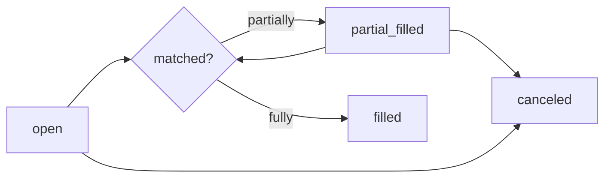

An **order** is an instruction to buy or sell shares in a market outcome. When you place an order, you specify which market you want to trade, which side (buy or sell), what position to take, and how many shares or how much to spend.

Orders are created via `POST /orders/`, listed via `GET /orders/`, and canceled via `PATCH /orders/{id}/cancel/`.

## Order types

<Tabs>
  <Tab title="Market order">
    Set `price` to `null` to place a market order. The order executes immediately at the best available price in the order book.

    Use market orders when you want guaranteed execution and don't need to control the exact price.

    ```json
    {
      "market": 42,
      "side": "bid",
      "position": "l",
      "amount": 10.00,
      "currency": "OOM",
      "price": null
    }
    ```
  </Tab>
  <Tab title="Limit order">
    Set `price` to a specific value (between 0 and 1) to place a limit order. The order sits in the order book and only executes when a counterparty matches your price.

    Use limit orders when you want to trade at a specific probability and are willing to wait.

    ```json
    {
      "market": 42,
      "side": "bid",
      "position": "l",
      "amount": 10.00,
      "currency": "OOM",
      "price": 0.45
    }
    ```
  </Tab>
</Tabs>

## Side: bid vs ask

The `side` field specifies whether you are buying or selling shares.

| Value | Meaning |
|---|---|
| `bid` | You are **buying** shares |
| `ask` | You are **selling** shares you already hold |

## Position: long vs short

The `position` field specifies which direction you are betting.

| Value | Meaning |
|---|---|
| `l` (long) | Betting **in favor** of the outcome — you profit if it resolves true |
| `s` (short) | Betting **against** the outcome — you profit if it resolves false |

<Note>
  Long and short positions can both be bought (`bid`) or sold (`ask`). For example, selling a long position (`ask` + `l`) reduces your existing long exposure.
</Note>

## Order lifecycle



| Status | Description |
|---|---|
| `open` | The order is in the order book, waiting to be matched |
| `partial_filled` | Some shares have been matched; the rest remain open |
| `filled` | The order has been fully executed |
| `canceled` | The order was canceled before fully filling |
| `processing` | The order is being processed — transient state |

## Order fields reference

<AccordionGroup>
  <Accordion title="shares vs amount">
    You can specify how much to trade using either `shares` or `amount` — not both.

    - `shares`: the number of shares you want to buy or sell
    - `amount`: the total monetary value to spend or receive, in the specified `currency`

    Use `amount` when you want to spend a fixed budget. Use `shares` when you want to acquire a specific quantity.
  </Accordion>
  <Accordion title="expired_at">
    Set `expired_at` to an ISO 8601 datetime string to automatically cancel any unfilled portion of the order after that time.

    If omitted, the order remains open until filled, manually canceled, or the event closes.

    ```json
    {
      "expired_at": "2024-11-05T23:59:00Z"
    }
    ```
  </Accordion>
  <Accordion title="cancel_conflicting_orders">
    Set `cancel_conflicting_orders` to `true` to automatically cancel any of your existing open orders on the same market that would conflict with the new order before placing it.

    This is useful when you want to change your position without manually canceling previous orders first.
  </Accordion>
</AccordionGroup>

## Full order fields

| Field | Type | Description |
|---|---|---|
| `market` | integer | ID of the market (outcome) to trade |
| `side` | string | `bid` (buy) or `ask` (sell) |
| `position` | string | `l` (long) or `s` (short) |
| `price` | float \| null | Limit price 0–1, or `null` for a market order |
| `shares` | float | Number of shares (use instead of `amount`) |
| `amount` | float | Monetary amount to spend (use instead of `shares`) |
| `currency` | string | `OOM`, `USDC`, `USDT`, or `USD` |
| `expired_at` | datetime | Auto-cancel time for unfilled order |
| `cancel_conflicting_orders` | boolean | Cancel conflicting open orders before placing |

<Warning>
  Real money orders (USDC, USDT, USD) are restricted in some countries. See [Currencies](/concepts/currencies) for details.
</Warning>
