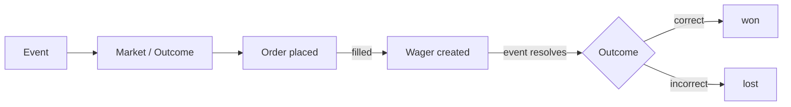

A **wager** represents a position you hold in a market. When an order fills (fully or partially), the resulting shares you own become a wager. You can think of a wager as a record of your stake in a particular outcome.

Wagers are read-only — they are created automatically when orders execute, not by direct API calls.

## How wagers relate to orders and events



- One order can produce one or more wagers as it fills over time.
- A wager is always linked to a specific market (outcome) within an event.
- Multiple wagers on the same market are aggregated into your net position.

## Wager statuses

| Status | Description |
|---|---|
| `purchased` | Active position — the event is still open or closed but unresolved |
| `sold` | You sold this position before the event resolved |
| `won` | The event resolved and this outcome was correct — payout received |
| `lost` | The event resolved and this outcome was incorrect — stake forfeited |
| `disabled` | The wager has been administratively disabled |

<Note>
  A `purchased` wager means your position is active. It will transition to `won`, `lost`, or `sold` once the event resolves or you sell your shares.
</Note>

## Fetching your wagers

Use `GET /wagers/` to list wagers. You can also fetch wagers for a specific event via `GET /events/{id}/wagers/`.

### Filtering wagers

The `/wagers/` endpoint supports several filters:

| Filter | Description |
|---|---|
| `active` | Returns only wagers with `purchased` status |
| `past_bets` | Returns settled wagers (`won`, `lost`, `sold`) |
| `event` | Filter by event ID |
| `following` | Wagers on events you follow |
| `user` | Filter by user ID (for public wager history) |

```bash
# Get your active positions
GET /wagers/?active=true

# Get settled wagers for a specific event
GET /wagers/?past_bets=true&event=123
```

## Wager resolution

When an event resolves, the API automatically settles all wagers associated with it:

- Wagers on the **winning** market transition to `won`. Any payout is credited to your account.
- Wagers on **losing** markets transition to `lost`. The staked amount is not returned.
- If you sold your position before resolution (via an `ask` order), the wager transitions to `sold` regardless of the outcome.

<Tip>
  Use `GET /events/{id}/wagers/` to retrieve wager history for a specific event across all users, useful for displaying market participation data in your application.
</Tip>
